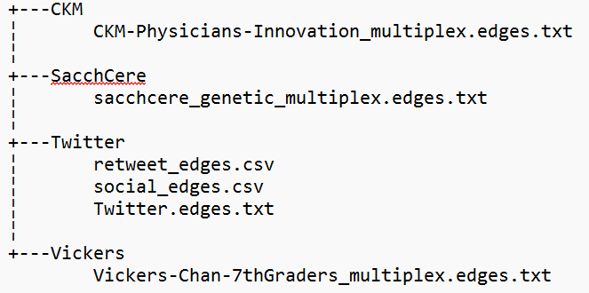

# MNE4LinkPred_Review
The repository holds the code and experimentation to the paper "Embedding Learning on Multiplex Networks for Link Prediction"

To get started clone the repository to your local computer. Then run 

    conda create -n mne_review python=3.10 
    pip install -r requirements.txt
    
in the anaconda prompt inside the repository. 

To reproduce the resoluts from our paper, follow these steps:

To compute the Chvatal lower bounds:
1) First download the Vickers, CKM, SacchCere and social and retweet Higgs Boson datasets from https://manliodedomenico.com/data.php.
2) Save the files as .txt in a directory called Datasets according to the tree:

Datasets:

3) Now run

       python construct_twitter.py

   in your command line. After a few seconds the Twitter.edges.txt file should appear in the Twitter subdirectory.

4) Now run

       python lower_bound.py

   in your comman line. When the execution is finished you will see a latex-style table at the bottom of your terminal with the Chvatal lower bounds.

To compute the testing procedures follow these steps:
1) run

       python testing_procedure.py

   in your terminal. When the execution is finished, you should three latex-style tables at the bottom of your terminal with the results, just as in the paper.
   
